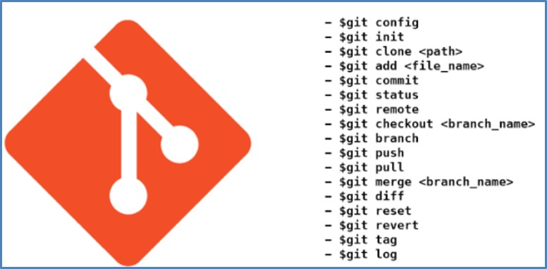
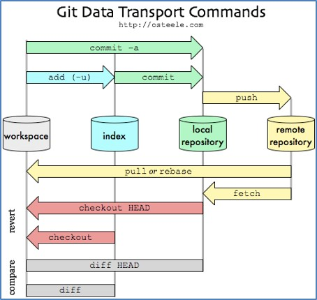
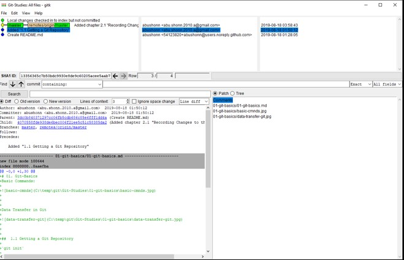
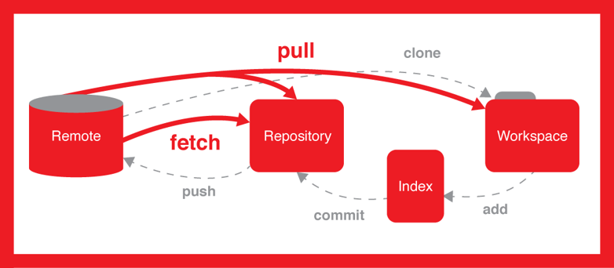

# 01. Git-Basics 
Basic Commands:

Data Transfer in Git

##  1.1 Getting a Git Repository

`git init`

Initializing a Repository in an Existing Directory

`git add *.java`

add to index (stage)

`git commit -m 'initial project version'`

add to local repo

`git clone https://github.com/abushonn/SmartGitDemo.git`

Cloning an Existing Repository

##  1.2 Recording Changes to the Repository

`git status`

To determine which files are in which state.

`git add README`

In order to begin tracking a new file

`cat .gitignore`

Ignoring Files

`git diff`

To see what you have changed but not yet staged

`git diff --cached`

To see what you have staged so far

`git commit`

Commit; message will be edited in the configured editor (default - vim) 

`git commit -m "Story 182: Fix benchmarks for speed"`

Commit with message

`git commit -a -m 'automatically adds not staged files'`

Skipping the Staging Area.

`git rm a.txt`

To remove file from your tracked files (remove it from your staging area) and then commit. 

##  1.3 Viewing the Commit History

`git log`

Lists the commits made in that repository in reverse chronological order.

` git log -2`

Two latest commits.

`git log --stat`

Some abbreviated stats for each commit.

`git log --pretty=oneline`

One line for each commit.

`git log --pretty=short`

For each commit: id, author, comment

`git log --after="2019-08-18 00:00:00" --before="2019-08-31 00:00:00"`

Limiting Log Output according to Date/Time.

`gitk`

A more graphical tool to visualize your commit history.

See [https://www.youtube.com/watch?v=yfivNnk0_Gg]( https://www.youtube.com/watch?v=yfivNnk0_Gg)

 

## 1.4 Undoing Things

`git commit --amend`

Updates which are in the staging area will be added to the latest commit (the latest commit will be updated).

E.g. :

`$ git commit -m 'initial commit'
$ git add forgotten_file
$ git commit --amend`

`git reset HEAD 01-git-basics/a1.txt`

Unstaging a Staged File

`git checkout -- 01-git-basics/01-git-basics.md`

Unmodifying a Modified File.  

## 1.5 Working with Remotes

`git remote -v` 

Showing Your Remotes

`git remote add arr https://github.com/abushonn/Another-Remote-Repo.git`

Adding Remote Repositories. `arr` - alias of the remote repo.

`git fetch arr`

To get data from your remote projects into local repo.

`git pull origin master`

Automatically fetch and then merge a remote branch into your current branch.

When you have your project at a point that you want to share, you have to push it upstream:

`git push origin master`

This command works only if you cloned from a server to which you have write access and if nobody has pushed in the meantime (pull is needed in such case).

`git remote show origin`

To see more information about a particular remote,

`git remote rename arr new-arr`

To rename a reference.

`git remote rm`

 To remove a reference for some reason.

Fetch vs Pull

## 1.6 Tagging

`git todo` 

todo

## 1.6 Tips and Tricks

`git todo` 

todo

