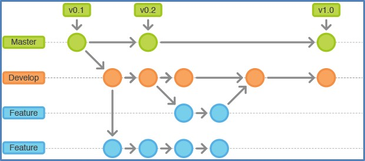

# 02. Git-Branching
Why branches:

##  2.1 What a Branch Is

Commit - node representing a committed change (data + metadata).

Commits are organized as a linked list ( a commit-node points to the previous commit) .

A commit is created for the following:

`$ git add README test.rb LICENSE`

`$ git commit -m 'initial commit of my project'`

A branch in Git is simply a lightweight movable pointer to one of these commits. The default branch name in Git is `master`. 

If you create a new branch a new pointer is created for you:

`$ git branch testing`

How does Git know what branch you’re currently on? It keeps a special pointer called HEAD.

To switch to an existing branch:

`$ git checkout testing`

Update and commit (in branch `tesing`):

`$ edit test.rb`

`$ git commit -a -m 'made a change'`

## 2.2 Basic Branching and Merging

`git xxx`

xxxx

## 2.3 Branch Management

`git xxx`

xxxx

## 2.4 Branching Workflows

`git xxx`

xxxx

## 2.5 Remote Branches

`git xxx`

xxxx

## 2.6 Rebasing

`git xxx`

Not now, somewhen in the future.

